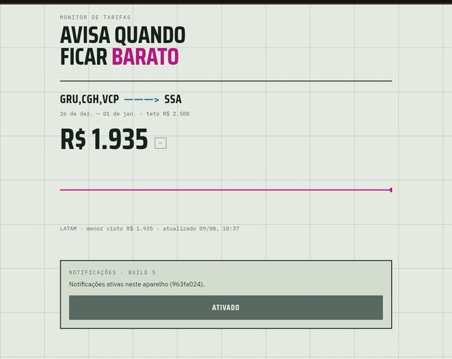
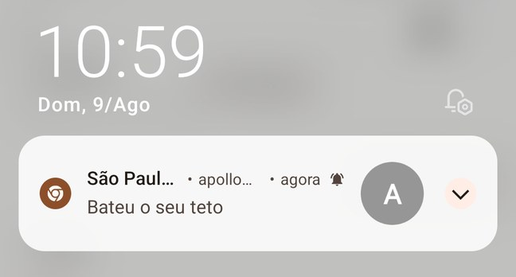
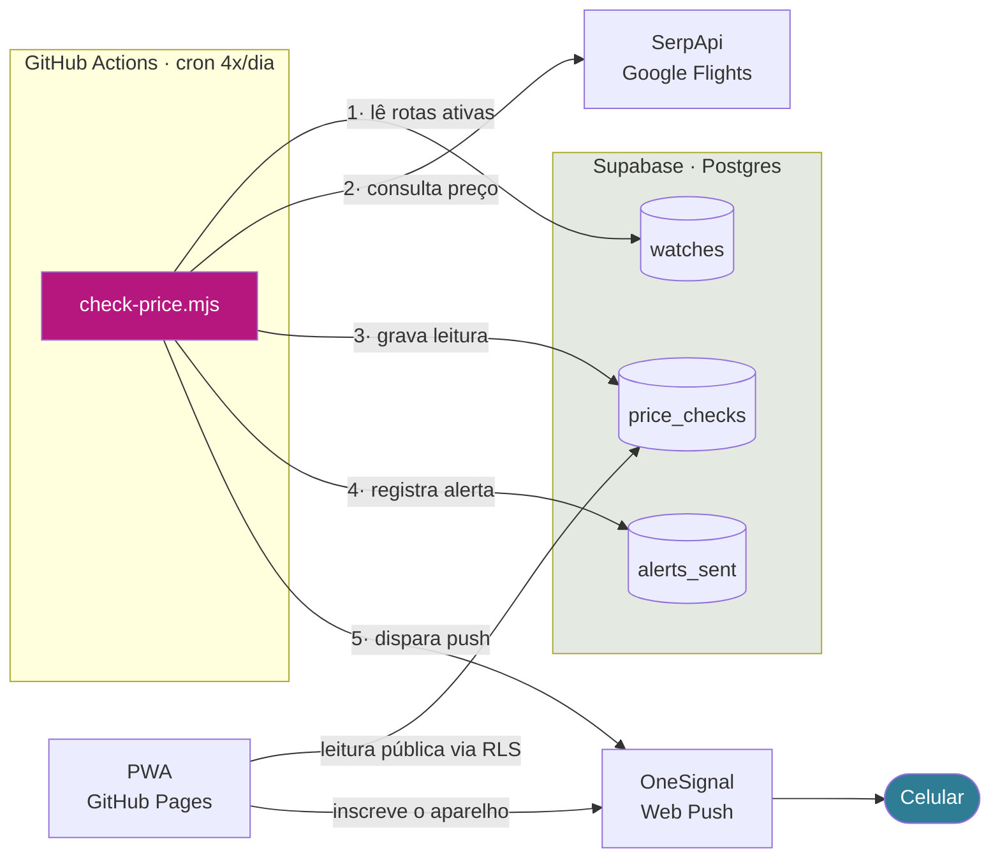
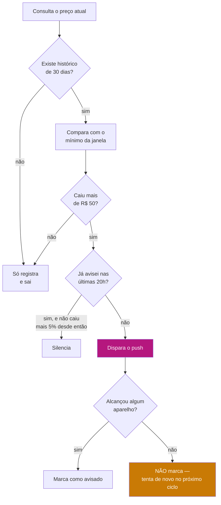
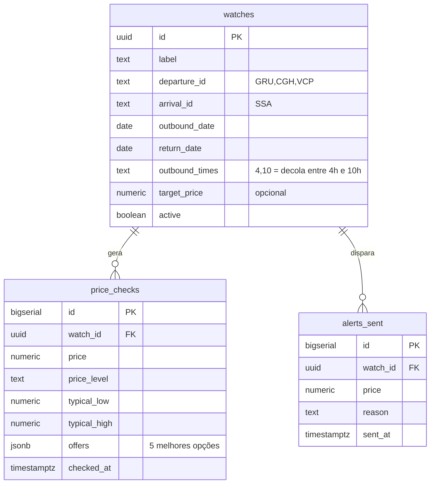

# FlyAlert

Cansei de abrir o Google Flights toda semana pra ver se a passagem tinha caído.
Montei isso pra ele me avisar sozinho.

O FlyAlert consulta rotas fixas de tempos em tempos, guarda o histórico de preço
e manda um push no meu celular quando a tarifa fica mais barata do que qualquer
valor visto nos últimos 30 dias.

**Custo mensal: R$ 0.** Roda inteiro em free tier — sem servidor, sem cartão.

<p align="center">
  
  &nbsp;&nbsp;
  
</p>

---

## Arquitetura

Não existe backend rodando em lugar nenhum. O "servidor" é um cron do GitHub
Actions que acorda, faz seu trabalho em 10 segundos e morre.



### Por que cada peça

| Peça | Papel | Por que essa |
|---|---|---|
| **GitHub Actions** | Cron | Já hospeda o código. Railway virou pago; Actions faz o mesmo de graça para um job de 10s |
| **Supabase** | Histórico | Postgres de verdade no free tier, com REST pronta e RLS para expor leitura sem backend |
| **SerpApi** | Preços | A Amadeus Self-Service foi descontinuada em julho/2026. Google Flights cobre LATAM, GOL, Azul e OTAs locais |
| **OneSignal** | Push | Web Push puro exige gerenciar chaves VAPID e service worker na mão. Free tier ilimitado pro meu volume |
| **GitHub Pages** | PWA | Estático, HTTPS de graça — requisito do Web Push |

---

## Como ele decide que está barato

A referência se move sozinha: é o menor preço registrado nos últimos 30 dias.
Não existe teto fixo pra eu ter que adivinhar.



Aquele último ramo em laranja custou caro pra descobrir. A primeira versão
marcava o alerta como enviado antes de confirmar a entrega — uma falha do
OneSignal me deixaria 20 horas em silêncio achando que já tinha avisado.

### Parâmetros

Ficam no topo do `scripts/check-price.mjs`:

```js
const COOLDOWN_HOURS = 20;   // não repete alerta antes disso
const REALERT_DROP  = 0.05;  // ...a menos que caia mais 5% do último alerta
const JANELA_DIAS   = 30;    // referência: mínimo observado no período
const MAX_OFERTAS   = 5;     // quantas opções guardar para comparação
const QUEDA_MINIMA  = 50;    // em R$ — ignora queda insignificante
```

---

## Modelo de dados



`departure_id` aceita vários aeroportos separados por vírgula, e o Google trata
como uma busca só — então cobrir Guarulhos, Congonhas e Viracopos não custa cota
extra. Como moro em Campinas, deixar VCP no páreo muda bastante a conta.

---

## O que aparece no app

- **Preço atual** e o menor já registrado
- **Gráfico de linha** com o histórico; quando o Google devolve a faixa de preço
  típica, ela aparece como um corredor sombreado ao fundo
- **Tabela comparativa** com as 5 opções mais baratas — preço, companhia,
  duração, paradas e horário de saída, com a diferença em reais em relação à
  primeira. É o que deixa ver o trade-off: às vezes R$ 150 a mais cortam três
  horas de conexão

O visual é inspirado em carta aeronáutica: papel verde-acinzentado, malha de
grade, magenta de aerovia.

---

## Setup

### 1. Supabase
Crie um projeto, abra o SQL Editor e rode `db/schema.sql`. Depois insira sua rota:

```sql
insert into watches
  (label, departure_id, arrival_id, outbound_date, return_date, outbound_times)
values
  ('São Paulo → Salvador', 'GRU,CGH,VCP', 'SSA', '2026-12-26', '2027-01-01', '4,10');
```

Anote em Settings → API: a **URL**, a **anon key** e a **service_role key**.

### 2. SerpApi
Conta em serpapi.com, copie a API key. Confira no dashboard quantas buscas o free
tier te dá — o número mudou algumas vezes em 2026.

### 3. OneSignal
App do tipo **Web**, Site URL apontando pro seu GitHub Pages. Anote **App ID** e
**REST API Key**.

### 4. Secrets do repositório
Settings → Secrets and variables → Actions:

| Secret | De onde vem |
|---|---|
| `SERPAPI_KEY` | dashboard do SerpApi |
| `SUPABASE_URL` | Supabase → Settings → API |
| `SUPABASE_SERVICE_KEY` | Supabase, service_role (**nunca** no front) |
| `ONESIGNAL_APP_ID` | OneSignal → Keys & IDs |
| `ONESIGNAL_API_KEY` | OneSignal, REST API Key |
| `ONESIGNAL_SUBSCRIPTION_ID` | opcional — mira um aparelho específico |

### 5. Front
Preencha as três constantes no topo do `docs/index.html` e publique a pasta
`docs/` no GitHub Pages (Settings → Pages → branch `main`, pasta `/docs`).

### 6. Testar
Actions → "Checar preços" → Run workflow. Depois abra o site no celular, ative as
notificações e adicione à tela de início.

Pra testar sem enviar push: `DRY_RUN=true node scripts/check-price.mjs`.

---

## Pegadinhas que me custaram tempo

**Service worker em subpasta.** O OneSignal assume que o site está na raiz do
domínio e procura o worker em `/OneSignalSDKWorker.js`. Num projeto do GitHub
Pages o site vive em `/FlyAlert/`, e o SDK toma 404 — mas falha silenciosamente,
sem nem anexar o listener do botão. Passar `serviceWorkerPath` não basta: sem
`serviceWorkerOverrideForTypical: true` o SDK ignora o campo.

```js
await OneSignal.init({
  appId: ONESIGNAL_APP_ID,
  serviceWorkerOverrideForTypical: true,
  serviceWorkerPath: 'FlyAlert/OneSignalSDKWorker.js',
  serviceWorkerParam: { scope: '/FlyAlert/' },
});
```

**Permissão concedida ≠ inscrito.** Se o usuário já concedeu a permissão,
`requestPermission()` resolve na hora sem fazer nada. É preciso chamar
`PushSubscription.optIn()` explicitamente e esperar o `id` aparecer.

**Envio aceito ≠ entregue.** A API do OneSignal devolve 200 mesmo alcançando zero
aparelhos — o sinal está em `recipients: 0` com `errors: ["All included players
are not subscribed"]`. Vale checar sempre.

**Título cortado no Android.** A notificação trunca o fim do título, então o preço
vai na frente: `R$ 1.700 · São Paulo → Salvador`, não o contrário.

**Cron pausado.** Workflow agendado em repo público é desativado após 60 dias sem
commits. Qualquer commit reativa.

**Fuso.** O cron do Actions é UTC. `17 1,7,13,19 * * *` = 22h, 4h, 10h e 16h em
Brasília.

---

## Consumo de cota

1 rota × 4 consultas/dia ≈ **124 buscas/mês**. Ao adicionar rotas, ajuste o cron
em `.github/workflows/check-price.yml` pra não estourar o free tier.

## Limitações conhecidas

- A tabela comparativa mostra a foto da última consulta, não o histórico de cada
  itinerário. Rastrear opção por opção exigiria identificar cada voo por número.
- O Google nem sempre devolve `price_insights`; com múltiplos aeroportos de
  origem ou datas distantes, a faixa típica vem nula.
- **iOS**: push só funciona com o site adicionado à tela de início (16.4+). No
  Android funciona pelo navegador normal.
- O free tier do Supabase pausa projetos inativos. O cron a cada 6h mantém o
  projeto vivo, mas se o monitoramento parar por dias, é preciso reativar no painel.
